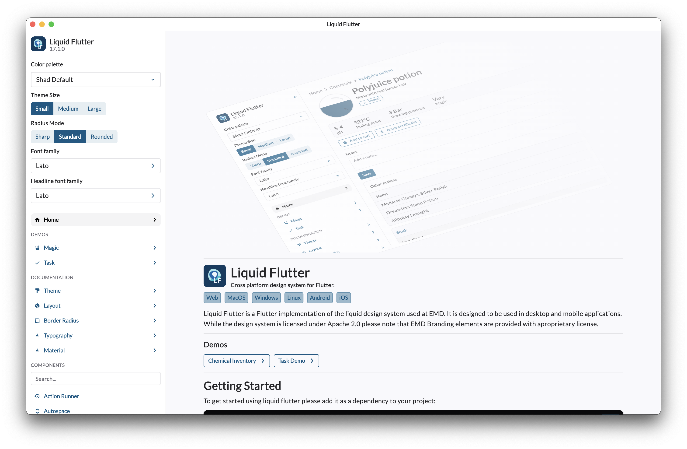

<p align="center">

</p>

## Liquid Flutter

This is a [flutter](https://flutter.dev) implementation of the [liquid design system](https://liquid.emd.design) used at EMD. It is designed to be used in desktop and mobile applications.
While the design system is licensed under [Apache 2.0](./LICENSE) please note that [EMD Branding elements](./emd_theme/) are provided with aproprietary license.


Please rely on the [online documentation](https://shiny-adventure-wo4ey4r.pages.github.io/)


This library incluse a copy of the Lato font licensed under the [Open Font License](https://fonts.google.com/specimen/Lato/license)


To simply install run
```sh
flutter pub add liquid_flutter
```
