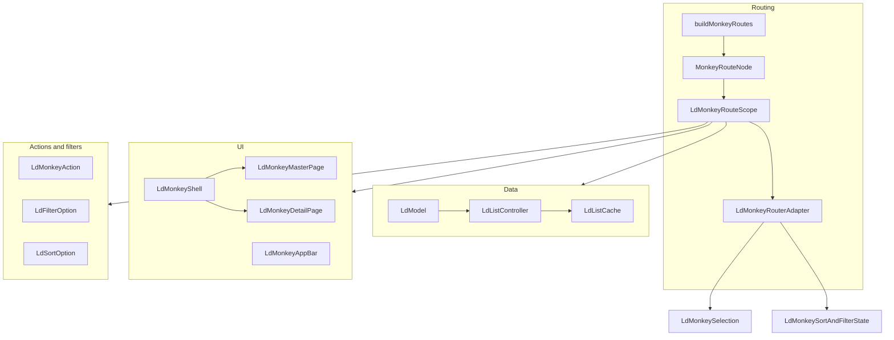

# Monkey system

Monkey is a URL-driven master-detail CRUD framework for `Identifiable<T, IdType>` items. One monkey level owns a list (master), optional detail routes, filters, sort, selection, and actions.

## Layers



## Provider stack

Each monkey level is mounted with [`LdMonkeyRouteScope`](monkey_route_scope.dart). Top to bottom:

1. **`LdMonkeyRouteConfig`** — query/path key names and id serialisation.
2. **`LdMonkeyActions`** — action list for this level.
3. **`LdMonkeyActionScope`** — per-build action host context.
4. **`LdMonkeyDataProvider`** — builds an [`LdModel`](data/ld_model.dart) and a matching [`LdListController`](data/list_controller.dart).
5. **`LdMonkeyRouteDefinitionsResolver`** — async filter/sort definitions; hydrates active state from the URL.
6. **`LdMonkeyRouterAdapter`** — sole GoRouter touchpoint. Parses/writes selection, viewing, filters, and sort to the URL. Provides:
   - `LdMonkeyRouterController` (static facades on selection/sort/filter call into this)
   - `LdMonkeySelection`
   - `LdMonkeySortAndFilterState`
   - `LdMonkeyListFilterAdapter` (refreshes list when filter/sort changes)
   - `LdMonkeyDeletedItemsGuard` (removes deleted ids from selection/viewing)
7. **`LdMonkeyActionHost`** + **`LdMonkeyShell`** — layout (master, detail, side-by-side) and pages.

## Data flow

- **List data** lives in `LdListController` (extends `LdPaginator`). Fetch parameters include active filters/sort from the widget tree.
- **Filter/sort state** is *not* stored on the list controller; it is URL-backed state exposed as `LdMonkeySortAndFilterState`.
- **Selection/viewing** is URL-backed via `LdMonkeySelection`. Use `LdMonkeySelection.updateSelection(context, ids)` and `updateViewing` — do not mutate sets locally.
- **Mutations** (create/update/delete) go through `LdListController` methods wired to `LdModel` callbacks. Cache invalidation uses `affectedByUpdate` on filters and sort options.

## Public API surface

Exported from `package:liquid_flutter/liquid_flutter.dart` via [`index.dart`](index.dart):

- Route builders: `buildMonkeyRoutes`, `LdMonkeyRouteScope`, `LdMonkeyRouteConfig`
- Data: `LdModel`, `LdCallbackModel`, `LdListController`, `LdListCache`, `Identifiable`
- UI: shell, master/detail pages, app bar, selection helpers
- Actions and filter/sort option types

Internal (not exported; subject to change):

- `LdMonkeyRouteStateParser`, `monkey_route_state_sync.dart` — URL parse/write helpers
- `resolveMonkeyRouteDefinitions` — definition hydration
- `LdMonkeyListFilterAdapter`, `LdMonkeyDeletedItemsGuard` — wired automatically by the router adapter
- `ldListCacheKey` / `parseLdListCacheKey` — list cache key encoding

## Typical app wiring

```dart
buildMonkeyRoutes(
  routeConfig: LdMonkeyRouteConfig.identifiableInt(itemName: 'task'),
  modelBuilder: (context, state) => taskModel,
  filtersBuilder: (context) async => [searchFilter, statusFilter],
  sortOptionsBuilder: (context) async => [nameSort, dateSort],
  actions: [
    reactiveCreateAction(routeConfig: routeConfig),
    refreshAction(),
    deleteAction(),
  ],
  masterPage: TaskMasterPage(),
  detailPageBuilder: (context, state) => TaskDetailPage(id: state.pathParameters['id']!),
);
```

See also the monkey skill at `packages/liquid_flutter/skills/liquid_flutter-monkey/SKILL.md` for end-to-end patterns and examples.
